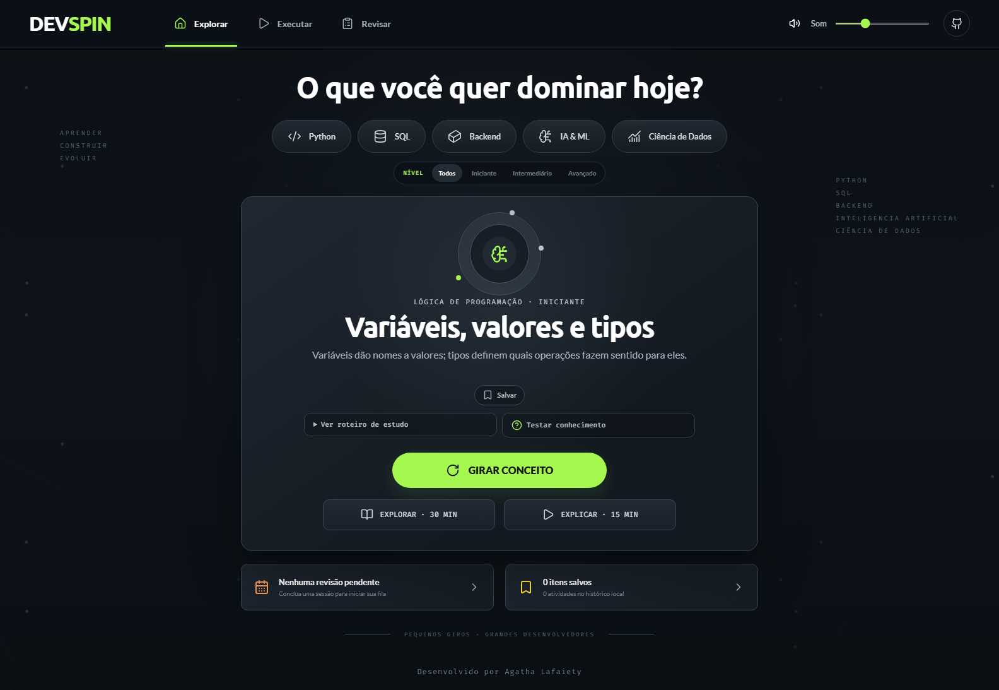

# DevSpin

Laboratório de aprendizagem ativa para desenvolvimento de software, inteligência artificial, machine learning e ciência de dados.

O DevSpin transforma o estudo em ciclos curtos de prática. Escolha uma área e um nível, sorteie um conceito ou desafio, teste seu conhecimento e organize revisões de acordo com sua própria avaliação.

[Acessar o DevSpin](https://agathalafaiety.github.io/devspin-learning-lab/)



## Funcionalidades

- 50 conceitos e 25 desafios em 12 categorias
- Filtros por área e nível de dificuldade
- Mini-quizzes com respostas explicadas
- Sessões de estudo com temporizador
- Favoritos, histórico e fila de revisão
- Exportação e importação do progresso em JSON
- Funcionamento local, sem necessidade de conta

## Como executar

Clone o repositório e instale as dependências:

```bash
git clone https://github.com/agathalafaiety/devspin-learning-lab.git
cd devspin-learning-lab
npm install
```

Inicie a aplicação:

```bash
npm run dev
```

Depois, acesse `http://localhost:5173/`.

## Testes

Execute os testes automatizados:

```bash
npm test
```

Para validar os fluxos completos no navegador:

```bash
npx playwright install chromium
npm run test:e2e
```

## Estrutura

```text
apps/web/              Aplicação web
content/concepts/      Biblioteca de conceitos
content/challenges/    Biblioteca de desafios
docs/                  Documentação do projeto
tests/e2e/             Testes no navegador
```

## Licença

Este projeto está disponível sob a licença MIT.

Desenvolvido por [Agatha Lafaiety](https://github.com/agathalafaiety).
