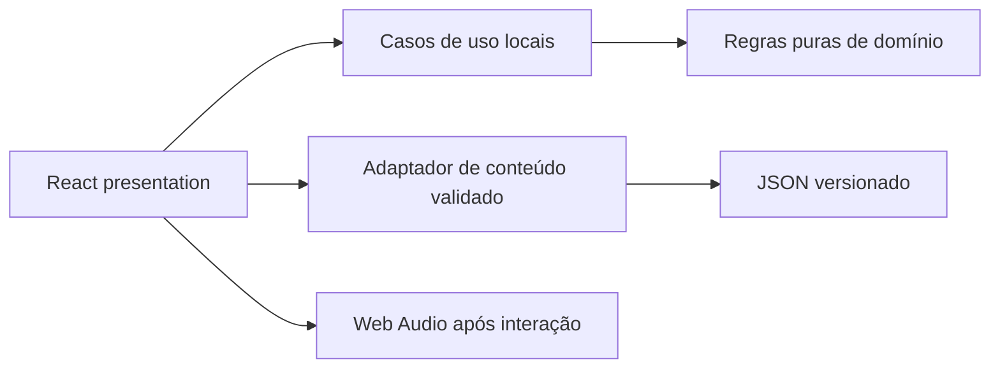

# Fase 1 · incremento 1 — fundação visual

## Escopo entregue

- toolchain Vite, React e TypeScript estrito;
- tokens visuais reutilizáveis;
- Home responsiva com modos Explorar, Executar e Revisar;
- filtros combináveis, Spin Core e prevenção de repetição imediata;
- temporizador baseado em horário final, com pausa e conclusão antecipada;
- áudio sintetizado sem autoplay, com mute e volume persistidos;
- 3 conceitos e 2 desafios provisórios, validados em build e testes;
- comandos locais para lint, testes, build e auditoria de dependências.

## Refinamento visual baseado no MVP da autora

A Home passou a usar a composição do MVP como direção principal: navegação horizontal, cinco trilhas de alto nível, nível compacto, card central único com órbita, sorteio dentro do card, ações cronometradas lado a lado e atalhos locais abaixo. Valores de progresso ainda inexistentes permanecem zerados ou identificados como futuros.

## Limites deliberados

Favoritos, histórico, fila de revisão e a matriz definitiva de 50 conceitos e 25 desafios pertencem aos próximos incrementos da Fase 1. O modo Revisar aparece como estado provisório, sem simular uma funcionalidade ainda não implementada.

